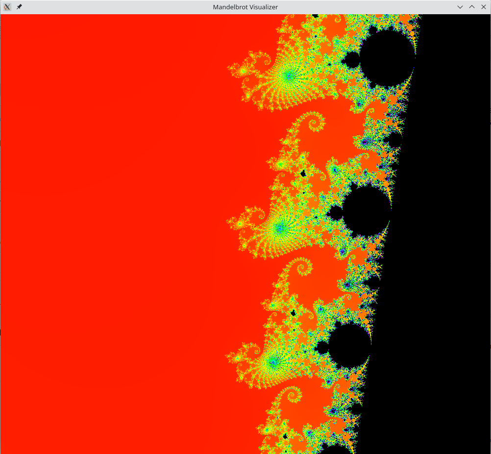
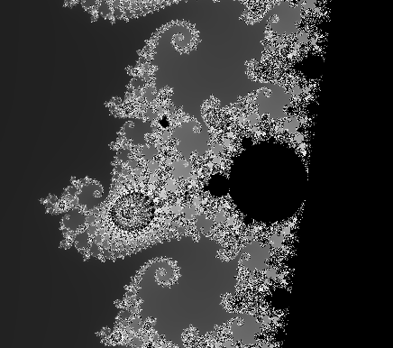
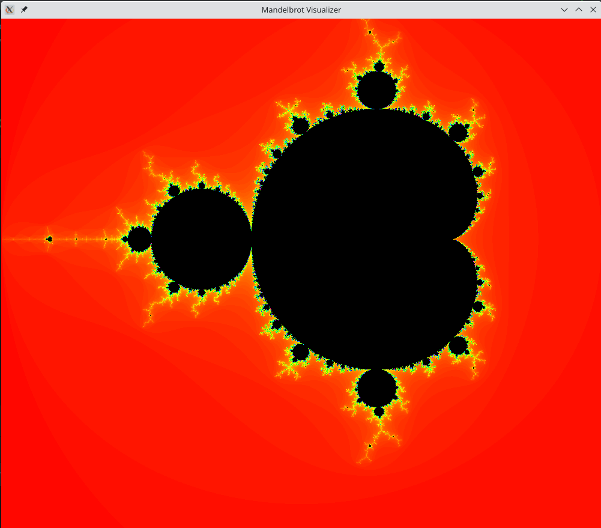

# Mandelbrot-visualizer
- This is a program to visualize the [Mandelbrot set](https://en.wikipedia.org/wiki/Mandelbrot_set) using java and java FX

- The program uses the escape time algorithm to render the image on a JavaFX canvas

Some Images from the program:

||
|:--:|
|*Sea Horse Valley*|

|  |
|:------------------------------------------:|
|  *A black render of the Sea Horse Valley*  |

|  |
|:-----------------------------------:|
|     *A render of the full view*     |

**Improvement and pull requests are always welcomed :)**